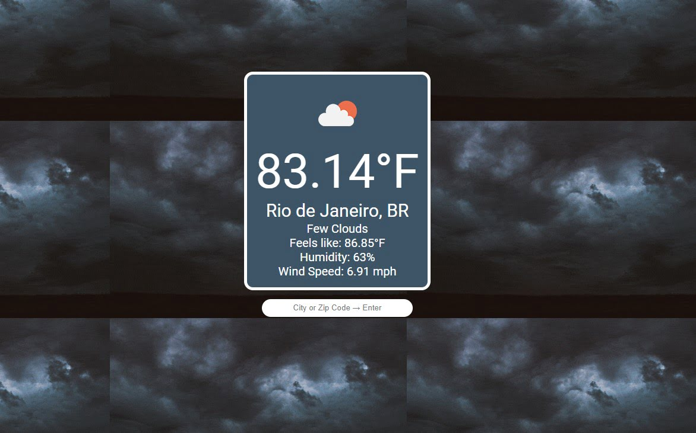

# JS Weather

### [Live Demo](https://danmenjivar.github.io/js-weather/)

#### 📝 Description
 
Simple weather web app. A project from [the Odin Project Curriculum](https://www.theodinproject.com). 

#### 💡 Features
* Display current weather for all OpenWeatherAPI supported locations
* Fun tiled GIFs matching the weather of the location.

#### 🛠️ Built with
* HTML
* CSS
* JavaScript
* OpenWeatherAPI
* GiphyAPI

